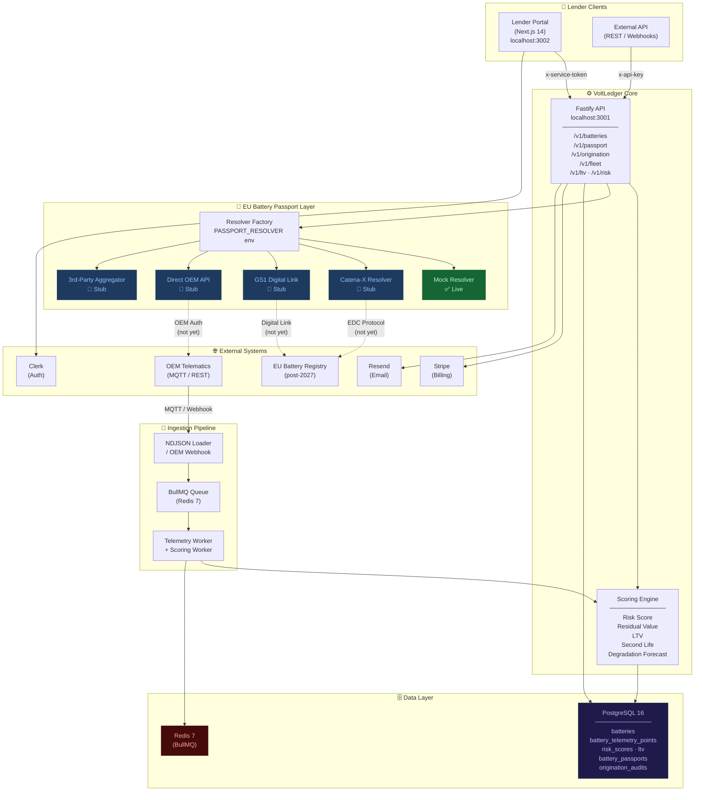
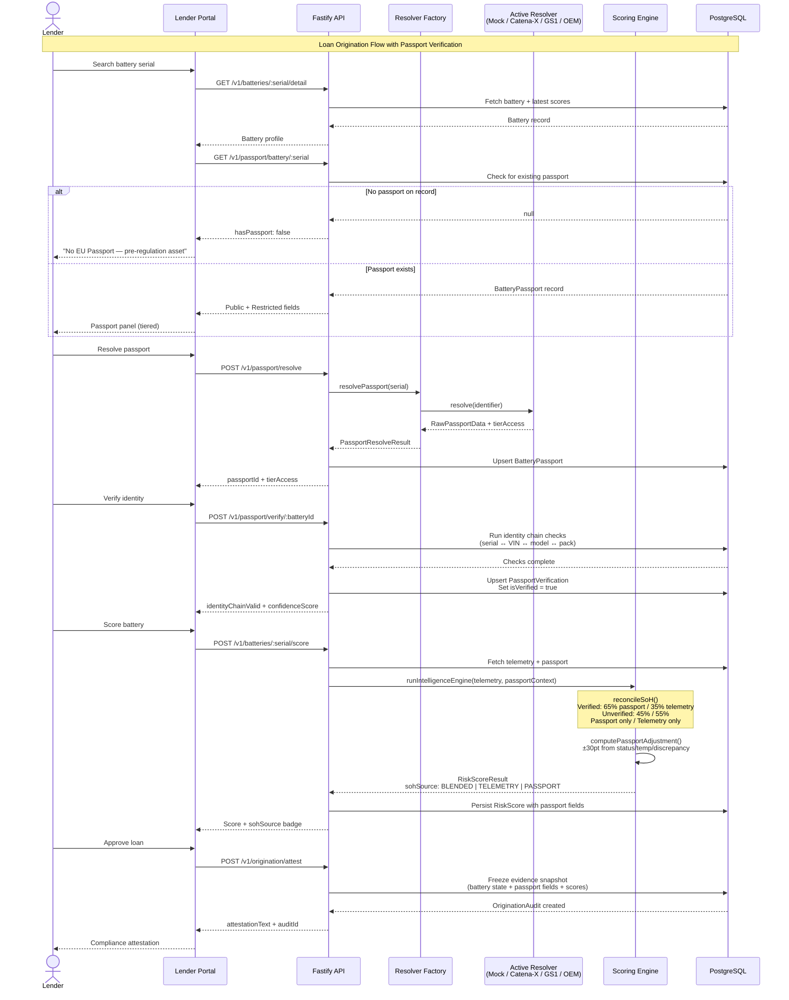
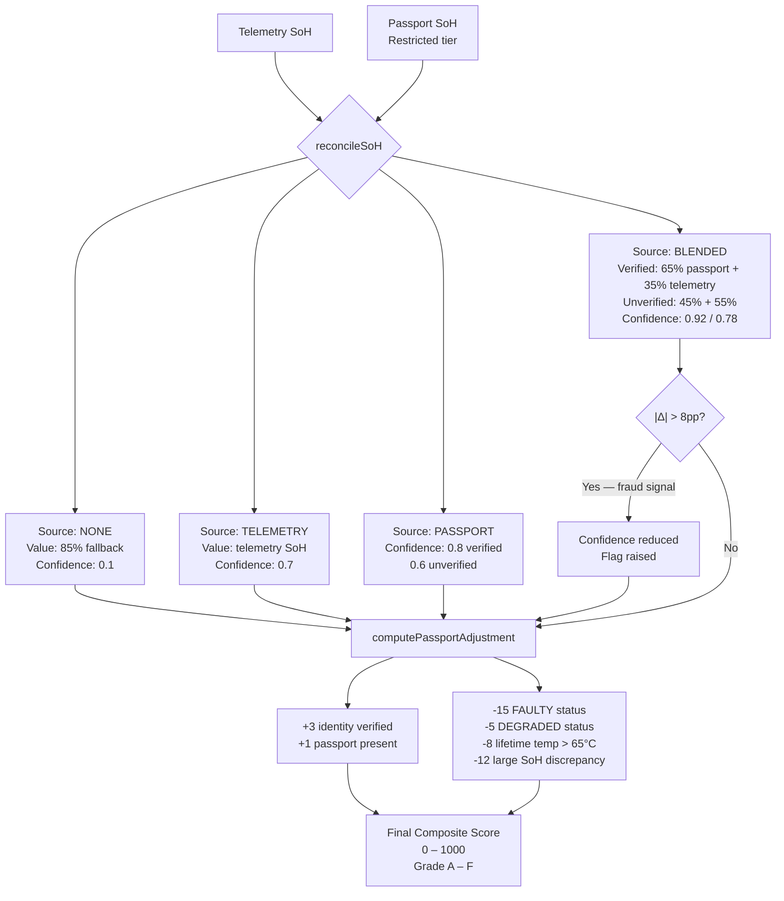
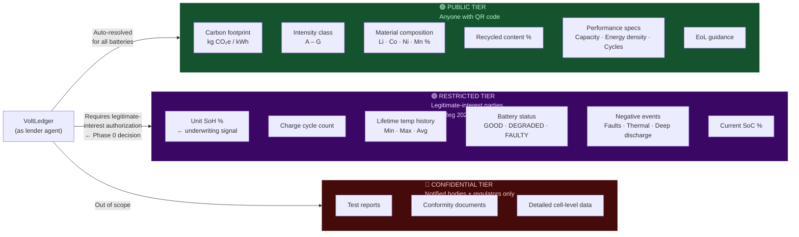
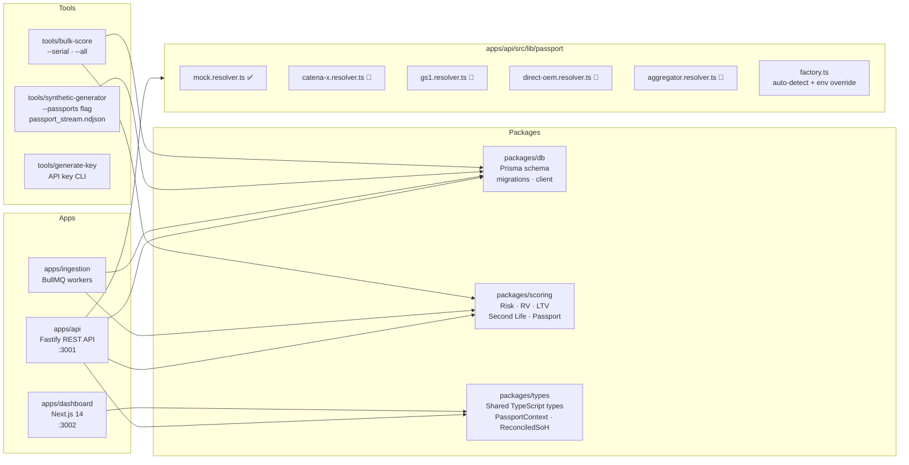

# VoltLedger — System Architecture

## 1. Platform Overview

---

## 2. EU Battery Passport — Data Flow

---

## 3. Scoring Engine — SoH Reconciliation

---

## 4. Access Tier Model

---

## 5. Monorepo Layout

